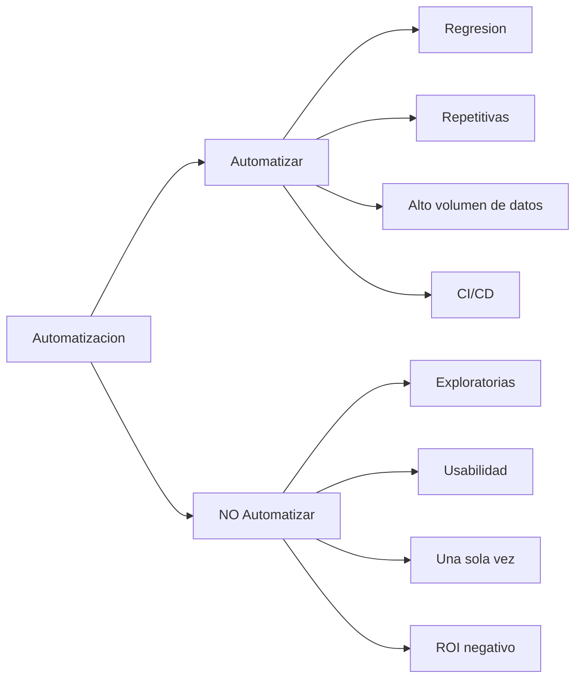
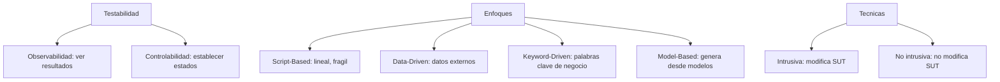
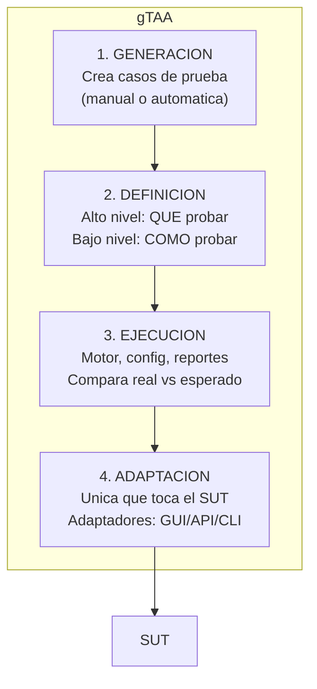
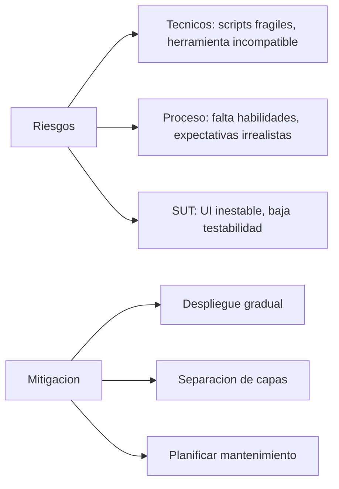
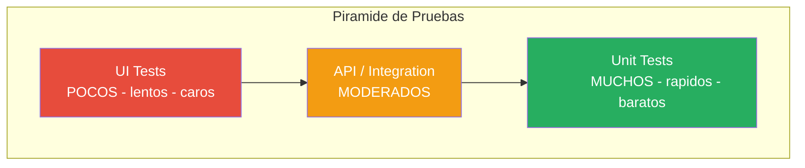
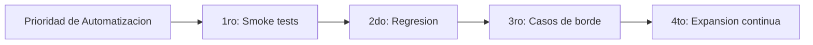
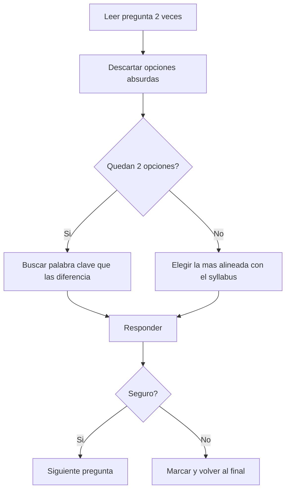

# ISTQB TAE - Resumen Rapido (Cheat Sheet)

> [!TIP]
> Repasa este documento el dia antes del examen. Contiene lo esencial de cada capitulo en formato compacto.

---

## Datos del Examen

| | |
|---|---|
| **40 preguntas** | Opcion multiple |
| **90 min** | 120 min si no es tu idioma nativo |
| **65%** | 26/40 para aprobar |
| **K2-K3-K4** | Comprension, Aplicacion, Analisis |

---

## Cap 1: Introduccion

> [!IMPORTANT]
> - Automatizacion **complementa**, NO reemplaza pruebas manuales
> - ROI mejora con cada ejecucion adicional
> - Factores de exito: testabilidad del SUT + arquitectura del TAS + habilidades del equipo

---

## Cap 2: Preparacion

> [!IMPORTANT]
> - Seleccion de herramientas = **PoC** (Proof of Concept), no por marketing
> - **Test hook** = punto de acceso intrusivo en el SUT
> - **Keyword-Driven** permite participacion de no-tecnicos

---

## Cap 3: gTAA (EL MAS IMPORTANTE)

> [!WARNING]
> **Reglas clave para el examen:**
> - Solo la **capa de adaptacion** toca el SUT
> - Si cambia la UI → solo cambia la **capa de adaptacion**
> - Alto nivel = QUE (negocio) | Bajo nivel = COMO (tecnico)
> - **Record & Playback**: rapido pero fragil, NO es estrategia a largo plazo

### Page Object Model (POM)

> [!IMPORTANT]
> - 1 Page Object = 1 pagina/componente del SUT
> - Encapsula **elementos** (localizadores) y **acciones** (metodos)
> - Si cambia la UI → solo cambia el Page Object, NO los tests
> - Reduce drasticamente el costo de mantenimiento

---

## Cap 4: Riesgos

> [!IMPORTANT]
> - **Falso positivo** = falla la prueba pero el SUT esta bien (reduce confianza)
> - **Falso negativo** = pasa la prueba pero hay defecto (MAS peligroso)
> - **Principal causa de fracaso** = mantenimiento no planificado
> - Despliegue: **Piloto → Expansion → Optimizacion**

### 4 Tipos de Mantenimiento

| Tipo | Cuando |
|------|--------|
| **Correctivo** | Defecto en el TAS |
| **Adaptativo** | Cambia el SUT o entorno |
| **Perfectivo** | Mejorar rendimiento/estructura |
| **Preventivo** | Refactorizar proactivamente |

---

## Cap 5: Metricas

> [!IMPORTANT]
> - **Piramide**: muchas unitarias, pocas UI
> - **Cono de helado** (anti-patron): muchas UI, pocas unitarias
> - **Trazabilidad bidireccional**: Requisito ↔ Prueba
> - 95% pass rate ≠ buena cobertura (puede haber areas no cubiertas)

### Metricas Clave

| Del TAS | Del SUT |
|---------|---------|
| # scripts automatizados | Defectos encontrados |
| Tiempo de ejecucion | Cobertura de codigo |
| Tasa pass/fail | Cobertura de requisitos |
| Costo mantenimiento/script | Densidad de defectos |

---

## Cap 6: Transicion

> [!IMPORTANT]
> - Transicion **gradual e incremental**, nunca todo de golpe
> - **TAE** = disena, desarrolla y mantiene scripts y framework
> - Mejora continua con ciclo **PDCA** (Plan-Do-Check-Act)
> - **Modelo de madurez**: Inicial → Gestionado → Definido → Medido → Optimizado

---

## Formula de Supervivencia para el Examen

> [!CAUTION]
> **Trampas comunes en el examen:**
> - Palabras como "siempre", "nunca", "todos", "ninguno" → generalmente son **FALSAS**
> - "La automatizacion elimina/reemplaza X" → generalmente es **FALSO**
> - Si dos opciones parecen correctas → busca la que menciona un concepto del syllabus
> - Las respuestas mas largas y especificas suelen ser las correctas

> [!TIP]
> **Distribucion de tiempo:**
> - Preguntas K2: ~1.5 min cada una
> - Preguntas K3: ~2 min cada una
> - Preguntas K4: ~3 min cada una
> - Reserva 10 min al final para revisar las marcadas
