# ISTQB TAE - Resumenes Detallados por Capitulo

---

# Capitulo 1: Introduccion y Objetivos de la Automatizacion de Pruebas

## 1.1 Proposito de la Automatizacion

La automatizacion de pruebas es el uso de software para ejecutar pruebas, comparar resultados reales con esperados y generar reportes.

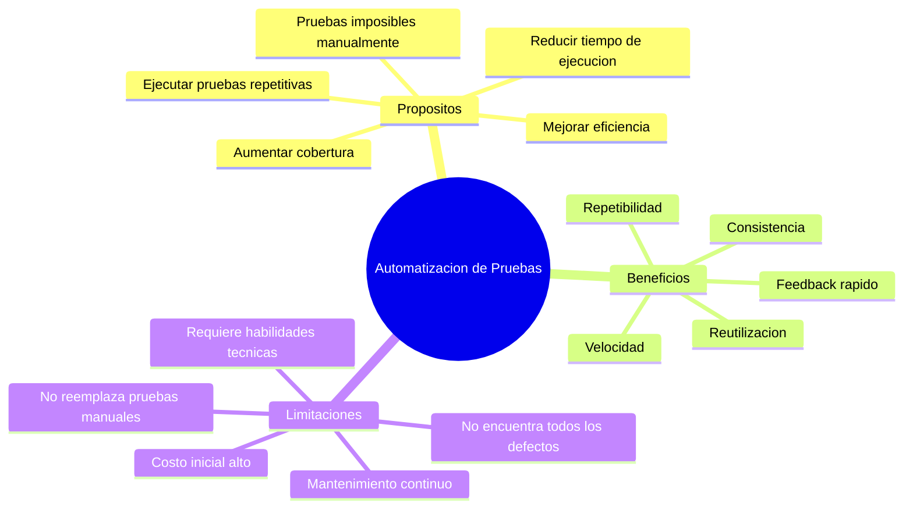

> [!IMPORTANT]
> La automatizacion **NO** reemplaza las pruebas manuales. Las complementa. Siempre habra pruebas que requieran juicio humano, como pruebas exploratorias o de usabilidad.

## 1.2 Factores de Exito

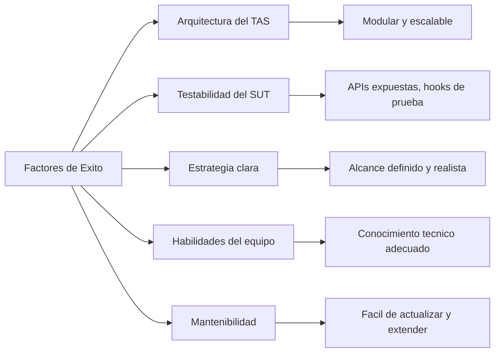

> [!TIP]
> Pregunta frecuente de examen: **"Cual es el factor MAS importante para el exito de la automatizacion?"**
> La respuesta suele estar relacionada con la **testabilidad del SUT** y una **arquitectura bien disenada del TAS**.

## 1.3 Cuando Automatizar y Cuando No

| Automatizar | NO Automatizar |
|------------|----------------|
| Pruebas de regresion | Pruebas que se ejecutan una sola vez |
| Pruebas repetitivas | Pruebas exploratorias |
| Pruebas con muchos datos | Pruebas de usabilidad |
| Pruebas de rendimiento | Requisitos que cambian constantemente |
| Pruebas en CI/CD | Pruebas con ROI negativo |

> [!NOTE]
> El **ROI (Return on Investment)** se calcula considerando:
> - Costo de desarrollo del script automatizado
> - Costo de mantenimiento continuo
> - Numero de veces que se ejecutara
> - Costo de ejecutar la misma prueba manualmente
>
> **Formula simplificada**: ROI = (Costo manual x N ejecuciones) - (Costo automatizacion + Costo mantenimiento)

## 1.4 Ventajas y Desventajas

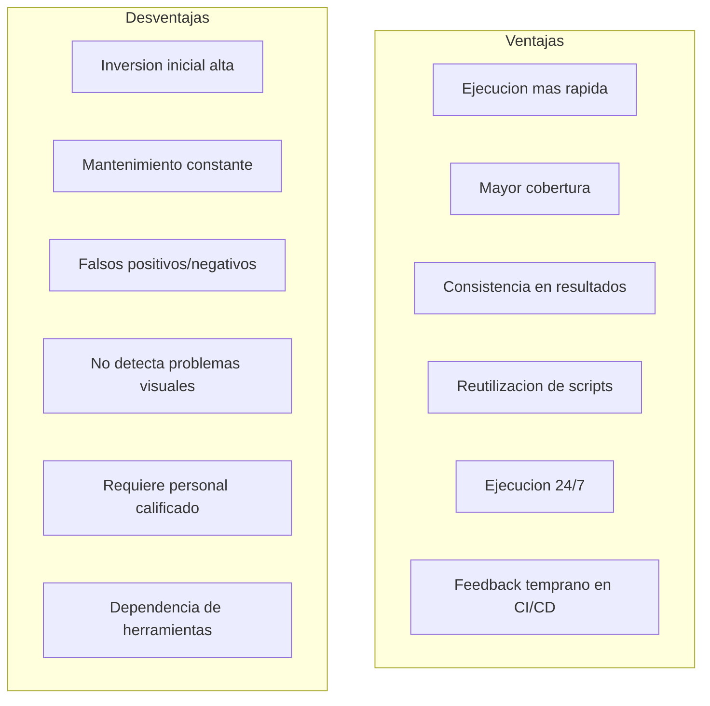

> [!CAUTION]
> Los **falsos positivos** (la prueba falla pero el sistema esta bien) y los **falsos negativos** (la prueba pasa pero hay un defecto) son riesgos criticos de la automatizacion. Reducen la confianza en el TAS.

---

## Preguntas de Repaso - Capitulo 1

> [!QUESTION]
> **P1: Cual de las siguientes NO es una ventaja de la automatizacion de pruebas?**
> a) Ejecucion mas rapida de pruebas de regresion
> b) Eliminacion total de pruebas manuales
> c) Mayor consistencia en la ejecucion
> d) Capacidad de ejecutar pruebas 24/7

> [!SUCCESS]
> **R1:** b) La automatizacion NO elimina las pruebas manuales. Las complementa.

> [!QUESTION]
> **P2: Cual es un prerrequisito importante antes de automatizar pruebas?**
> a) Tener el mayor numero de herramientas posible
> b) Evaluar la testabilidad del SUT
> c) Automatizar todas las pruebas existentes
> d) Eliminar las pruebas manuales primero

> [!SUCCESS]
> **R2:** b) Evaluar la testabilidad del SUT es fundamental antes de iniciar la automatizacion.

---

# Capitulo 2: Preparacion para la Automatizacion de Pruebas

## 2.1 Factores del SUT que Afectan la Automatizacion

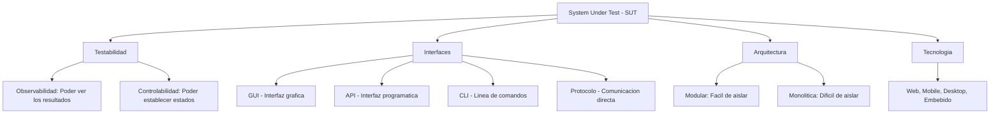

> [!IMPORTANT]
> **Testabilidad** tiene dos dimensiones clave:
> - **Observabilidad**: Capacidad de observar los resultados del SUT (outputs, logs, estados)
> - **Controlabilidad**: Capacidad de establecer el SUT en un estado deseado (inputs, precondiciones)
>
> Sin buena testabilidad, la automatizacion sera costosa y fragil.

## 2.2 Evaluacion y Seleccion de Herramientas

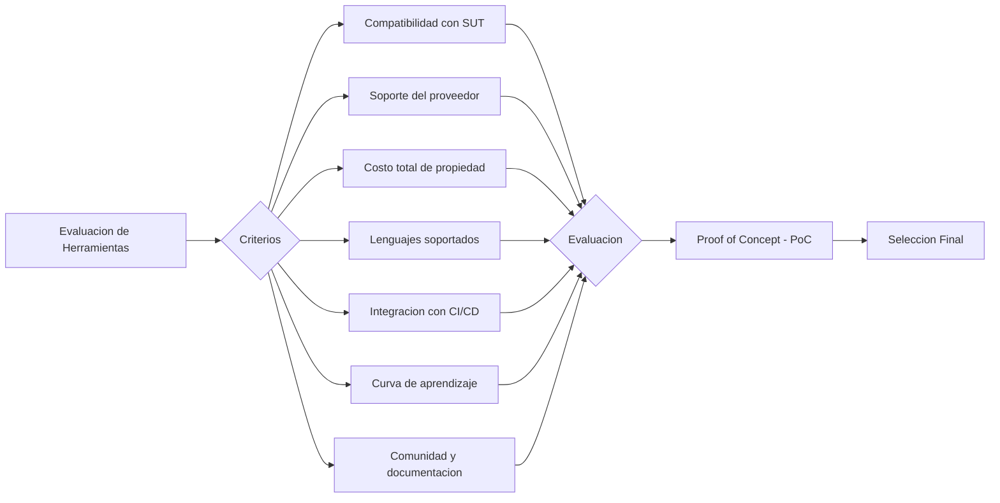

> [!TIP]
> En el examen, recuerda que la seleccion de herramientas debe basarse en un **Proof of Concept (PoC)** y NO solo en las caracteristicas del marketing del proveedor.

## 2.3 Diseno para Testabilidad

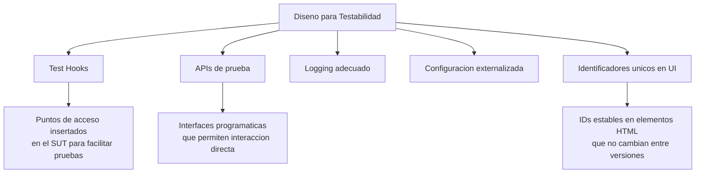

> [!WARNING]
> Las tecnicas de testabilidad pueden ser:
> - **Intrusivas**: Modifican el SUT (agregar hooks, APIs de prueba). Riesgo: pueden introducir defectos.
> - **No intrusivas**: No modifican el SUT (usar interfaces existentes). Mas seguras pero pueden ser mas limitadas.

## 2.4 Enfoques de Automatizacion

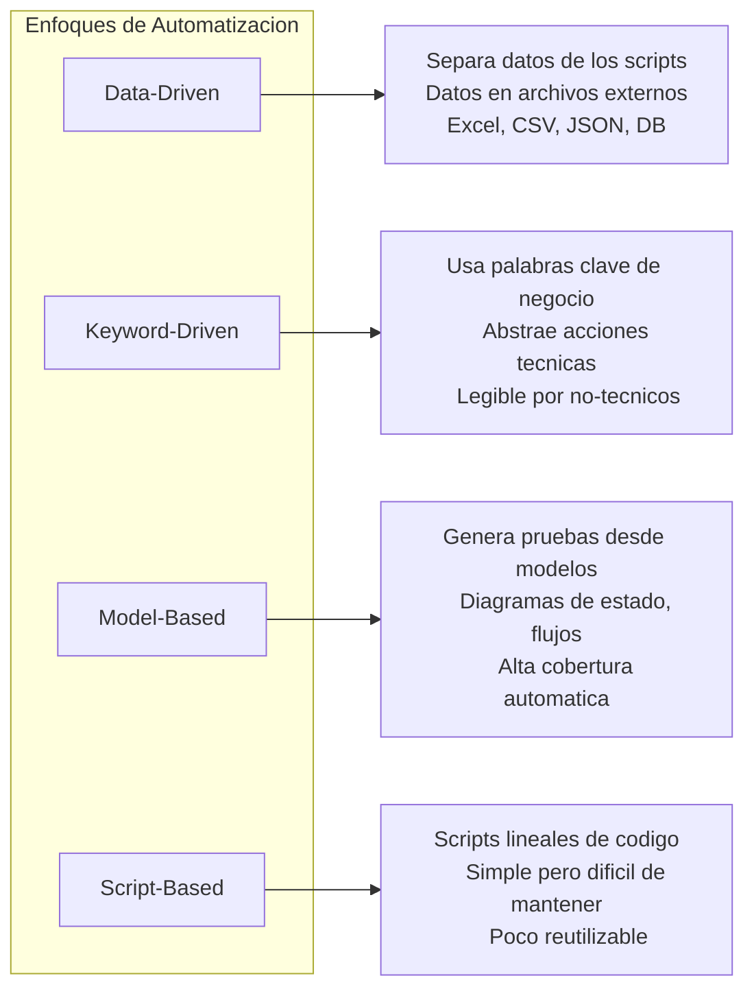

> [!NOTE]
> **Comparacion de enfoques:**
>
> | Enfoque | Reutilizacion | Mantenimiento | Habilidades Requeridas |
> |---------|:---:|:---:|:---:|
> | Script-Based | Baja | Dificil | Bajas |
> | Data-Driven | Media | Medio | Medias |
> | Keyword-Driven | Alta | Facil | Medias-Altas |
> | Model-Based | Alta | Medio | Altas |

---

## Preguntas de Repaso - Capitulo 2

> [!QUESTION]
> **P1: Que significa que un SUT tenga buena "controlabilidad"?**
> a) Que se puede observar facilmente su comportamiento
> b) Que se puede establecer en un estado deseado para las pruebas
> c) Que tiene una interfaz grafica intuitiva
> d) Que esta bien documentado

> [!SUCCESS]
> **R1:** b) La controlabilidad se refiere a la capacidad de establecer el SUT en un estado deseado.

> [!QUESTION]
> **P2: En un enfoque keyword-driven, quien puede crear los casos de prueba?**
> a) Solo programadores
> b) Solo testers automatizadores
> c) Personas sin conocimientos tecnicos profundos
> d) Solo el arquitecto de automatizacion

> [!SUCCESS]
> **R2:** c) El enfoque keyword-driven usa palabras clave de negocio, lo que permite que personas sin conocimientos tecnicos profundos participen en la creacion de casos de prueba.

---

# Capitulo 3: La Arquitectura Generica de Automatizacion de Pruebas (gTAA)

> [!IMPORTANT]
> Este es el **capitulo mas importante** del examen. La gTAA es el modelo central que debes dominar. Muchas preguntas K3 y K4 se basan en este capitulo.

## 3.1 Vision General de la gTAA

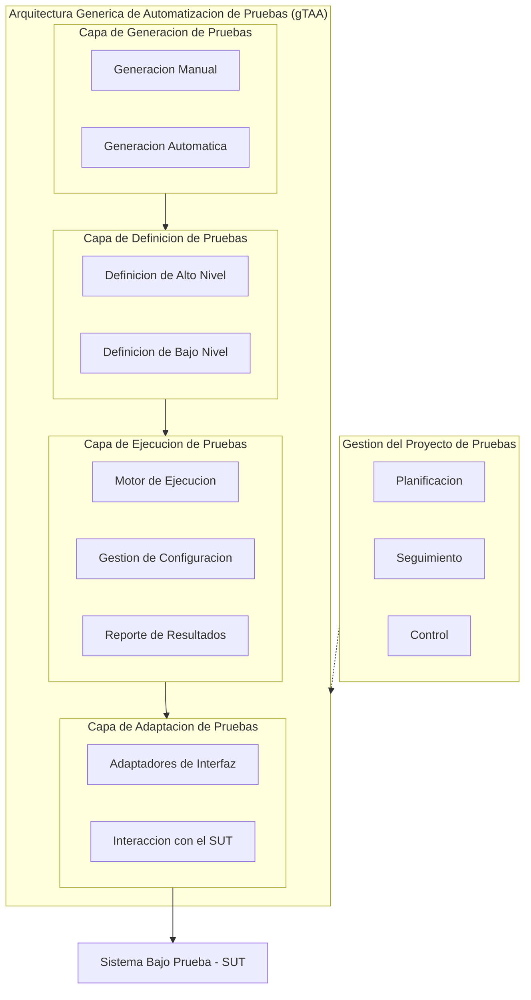

## 3.2 Capa de Generacion de Pruebas

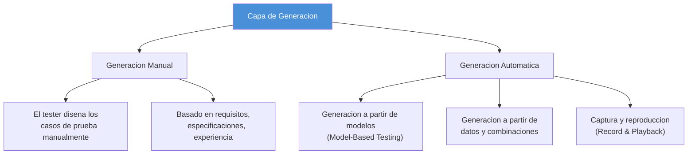

> [!NOTE]
> **Captura y Reproduccion (Record & Playback)**:
> - Util para crear scripts iniciales rapidamente
> - **Desventaja**: Los scripts generados son fragiles, dificiles de mantener y poco reutilizables
> - Se recomienda como punto de partida, NO como estrategia principal

## 3.3 Capa de Definicion de Pruebas

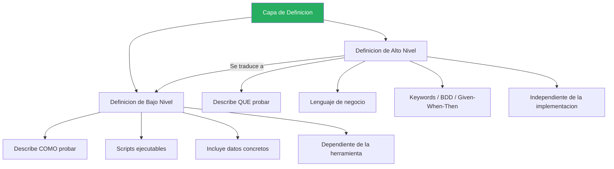

> [!TIP]
> Diferencia clave para el examen:
> - **Alto nivel** = QUE probar (independiente de herramienta)
> - **Bajo nivel** = COMO probar (dependiente de herramienta)
>
> Ejemplo:
> - Alto nivel: "Verificar que el usuario puede iniciar sesion con credenciales validas"
> - Bajo nivel: `driver.findElement(By.id("username")).sendKeys("admin")`

## 3.4 Capa de Ejecucion de Pruebas

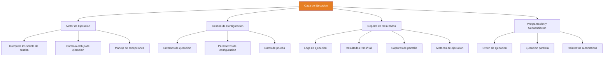

> [!WARNING]
> El motor de ejecucion debe manejar **excepciones** adecuadamente. Si un paso falla, debe:
> 1. Registrar el fallo con detalle suficiente
> 2. Tomar evidencia (screenshots, logs)
> 3. Decidir si continuar con el siguiente paso o abortar
> 4. Restaurar el estado del SUT si es necesario (teardown/cleanup)

## 3.5 Capa de Adaptacion de Pruebas

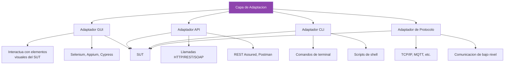

> [!IMPORTANT]
> La capa de adaptacion es la **unica capa que interactua directamente con el SUT**. Actua como un "traductor" entre el TAS y el SUT. Si el SUT cambia (por ejemplo, un boton cambia de ID), solo esta capa deberia necesitar modificacion.

## 3.6 Flujo Completo de la gTAA

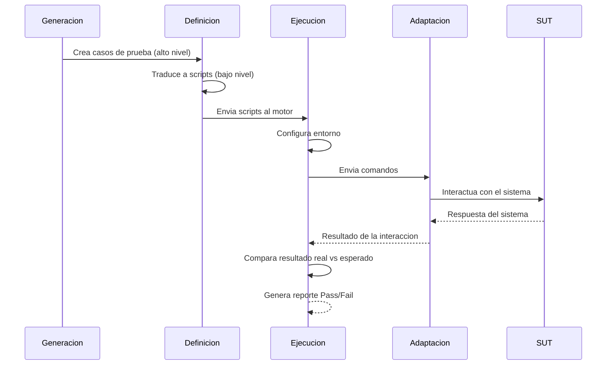

## 3.7 Patron de Diseno: Page Object Model

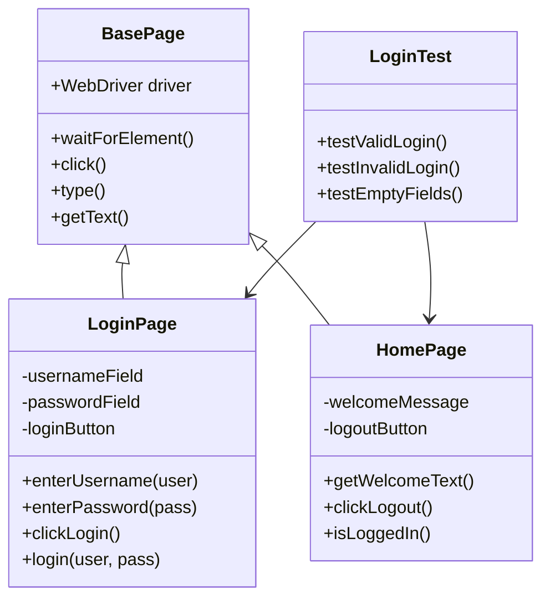

> [!TIP]
> El **Page Object Model (POM)** es un patron de diseno fundamental:
> - Cada pagina del SUT tiene una clase correspondiente
> - Los elementos de la pagina son atributos de la clase
> - Las acciones sobre la pagina son metodos de la clase
> - Los tests usan los page objects, NO interactuan directamente con los elementos
>
> **Beneficio**: Si cambia la UI, solo cambias el Page Object, no todos los tests.

---

## Preguntas de Repaso - Capitulo 3

> [!QUESTION]
> **P1: Cual capa de la gTAA interactua directamente con el SUT?**
> a) Capa de generacion
> b) Capa de definicion
> c) Capa de ejecucion
> d) Capa de adaptacion

> [!SUCCESS]
> **R1:** d) La capa de adaptacion es la unica que interactua directamente con el SUT.

> [!QUESTION]
> **P2: En la gTAA, donde se define "QUE probar" vs "COMO probar"?**
> a) En la capa de generacion (QUE) y ejecucion (COMO)
> b) En la capa de definicion: alto nivel (QUE) y bajo nivel (COMO)
> c) En la capa de adaptacion (QUE) y generacion (COMO)
> d) En la capa de ejecucion (QUE) y adaptacion (COMO)

> [!SUCCESS]
> **R2:** b) La capa de definicion tiene dos niveles: alto nivel (QUE probar) y bajo nivel (COMO probar).

> [!QUESTION]
> **P3: Si un boton en la interfaz del SUT cambia su ID, cual capa de la gTAA debe modificarse?**
> a) Capa de generacion
> b) Capa de definicion
> c) Capa de ejecucion
> d) Capa de adaptacion

> [!SUCCESS]
> **R3:** d) Solo la capa de adaptacion debe cambiar, ya que es la que interactua con los elementos del SUT.

> [!QUESTION]
> **P4: Cual es la principal ventaja del Page Object Model?**
> a) Hace los tests mas rapidos de ejecutar
> b) Centraliza la interaccion con la UI para reducir el impacto de cambios
> c) Elimina la necesidad de la capa de adaptacion
> d) Permite ejecutar tests sin navegador

> [!SUCCESS]
> **R4:** b) El POM centraliza la interaccion con la UI, de modo que un cambio en la interfaz solo requiere actualizar el Page Object correspondiente.

---

# Capitulo 4: Riesgos y Contingencias de Despliegue

## 4.1 Tipos de Riesgos

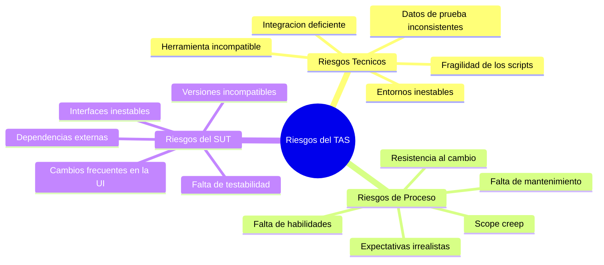

## 4.2 Gestion de Riesgos

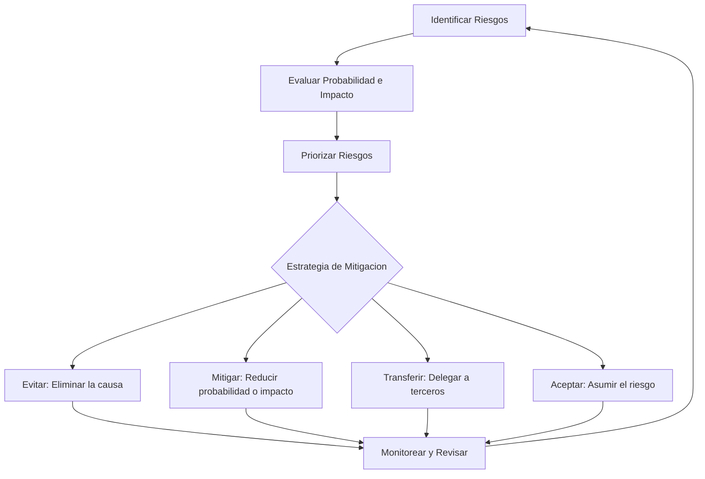

> [!WARNING]
> **Riesgos mas comunes y sus mitigaciones:**
>
> | Riesgo | Mitigacion |
> |--------|-----------|
> | Scripts fragiles | Usar patrones de diseno robustos (POM), waits explicitos |
> | Cambios frecuentes en UI | Aislar la interaccion en la capa de adaptacion |
> | Datos de prueba inconsistentes | Gestionar datos de prueba independientemente |
> | Falta de habilidades | Capacitacion continua del equipo |
> | Entornos inestables | Entornos dedicados para automatizacion |

## 4.3 Estrategia de Despliegue

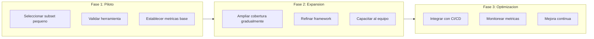

> [!TIP]
> El despliegue debe ser **gradual e incremental**. Nunca intentes automatizar todo de una vez. Un piloto exitoso da confianza y permite ajustar la estrategia antes de escalar.

## 4.4 Mantenimiento del TAS

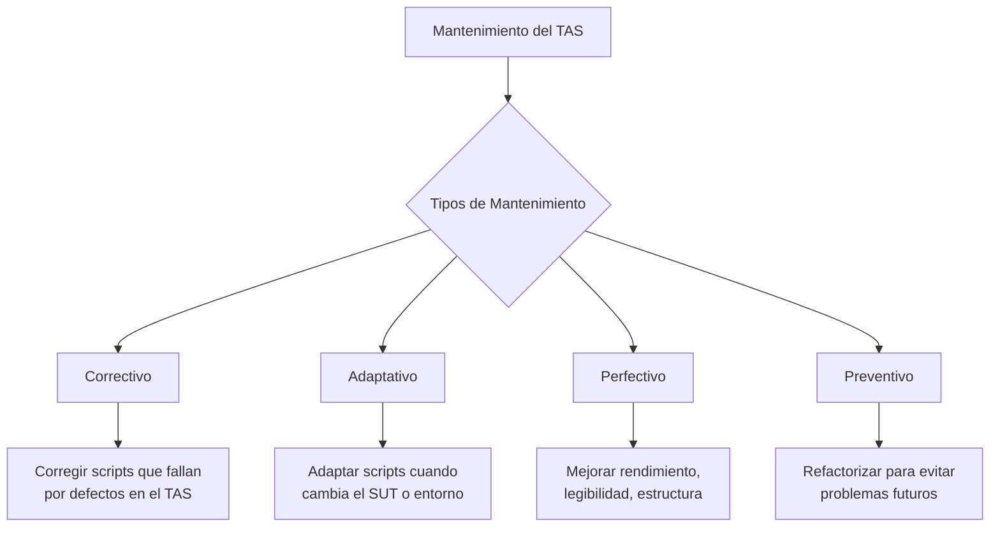

> [!CAUTION]
> El **costo de mantenimiento** es la principal razon por la que los proyectos de automatizacion fracasan. Planifica y presupuesta el mantenimiento desde el inicio del proyecto.

---

## Preguntas de Repaso - Capitulo 4

> [!QUESTION]
> **P1: Cual es la estrategia recomendada para desplegar la automatizacion de pruebas?**
> a) Automatizar todo de una sola vez para maximizar el ROI
> b) Un enfoque gradual e incremental comenzando con un piloto
> c) Esperar hasta que el SUT este completamente estable
> d) Comenzar por las pruebas mas complejas para demostrar valor

> [!SUCCESS]
> **R1:** b) El enfoque gradual e incremental permite validar la estrategia y ajustar antes de escalar.

> [!QUESTION]
> **P2: Cual es la principal causa de fracaso en proyectos de automatizacion?**
> a) Seleccion incorrecta de herramientas
> b) Falta de presupuesto inicial
> c) Costo de mantenimiento no planificado
> d) Falta de apoyo de la gerencia

> [!SUCCESS]
> **R2:** c) El costo de mantenimiento no planificado es la principal causa de fracaso. Los scripts requieren actualizacion continua.

---

# Capitulo 5: Reportes y Metricas de Automatizacion de Pruebas

## 5.1 Tipos de Metricas

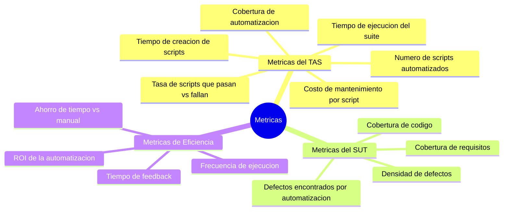

## 5.2 Piramide de Automatizacion de Pruebas

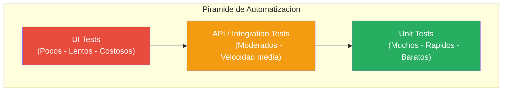

> [!IMPORTANT]
> La **piramide de pruebas** indica que:
> - La **base** (unit tests) debe ser la mas grande: son rapidos, baratos y estables
> - El **medio** (API/integracion) debe ser moderado
> - La **cima** (UI) debe ser la mas pequena: son lentos, caros y fragiles
>
> **Anti-patron**: El "cono de helado" invierte la piramide con muchas pruebas UI y pocas unitarias.

## 5.3 Dashboard y Reportes

```mermaid
flowchart TD
    EXEC[Ejecucion de Pruebas] --> RAW[Datos Crudos]
    RAW --> PROC[Procesamiento]

    PROC --> DASH[Dashboard]
    PROC --> REP[Reportes]
    PROC --> ALERT[Alertas]

    DASH --> D1[Estado actual de pruebas]
    DASH --> D2[Tendencias historicas]
    DASH --> D3[Cobertura visual]

    REP --> R1[Resumen ejecutivo]
    REP --> R2[Detalle tecnico]
    REP --> R3[Trazabilidad con requisitos]

    ALERT --> A1[Fallos criticos]
    ALERT --> A2[Degradacion de rendimiento]
    ALERT --> A3[Umbral de calidad no alcanzado]
```

> [!NOTE]
> Un buen reporte de automatizacion debe incluir:
> - **Resumen**: Pass/Fail totales, porcentaje de exito
> - **Tendencias**: Comparacion con ejecuciones anteriores
> - **Detalles de fallos**: Logs, screenshots, pasos para reproducir
> - **Trazabilidad**: Mapeo con requisitos y casos de prueba
> - **Metricas de eficiencia**: Tiempo total, tiempo promedio por test

## 5.4 Logging y Trazabilidad

```mermaid
flowchart LR
    REQ[Requisito] --> TC[Caso de Prueba]
    TC --> SCRIPT[Script Automatizado]
    SCRIPT --> RESULT[Resultado]
    RESULT --> DEFECT[Defecto - si falla]

    REQ -.->|Trazabilidad Completa| DEFECT
```

> [!TIP]
> La **trazabilidad bidireccional** permite:
> - Desde un requisito, saber que pruebas automatizadas lo cubren
> - Desde un defecto, saber que requisito se ve afectado
> - Identificar requisitos sin cobertura automatizada
> - Justificar el valor de la automatizacion ante stakeholders

---

## Preguntas de Repaso - Capitulo 5

> [!QUESTION]
> **P1: Segun la piramide de automatizacion, que tipo de pruebas deberian ser las mas numerosas?**
> a) Pruebas de UI
> b) Pruebas de integracion
> c) Pruebas unitarias
> d) Pruebas de rendimiento

> [!SUCCESS]
> **R1:** c) Las pruebas unitarias forman la base de la piramide y deben ser las mas numerosas.

> [!QUESTION]
> **P2: Que es el "anti-patron del cono de helado" en automatizacion?**
> a) Tener demasiadas pruebas unitarias
> b) Invertir la piramide con muchas pruebas UI y pocas unitarias
> c) No tener pruebas de integracion
> d) Ejecutar pruebas sin reportes

> [!SUCCESS]
> **R2:** b) El cono de helado es una piramide invertida donde la mayoria de las pruebas son de UI, lo cual es costoso, fragil y lento.

---

# Capitulo 6: Transicion de Pruebas Manuales a Automatizadas

## 6.1 Criterios para Seleccionar Pruebas a Automatizar

```mermaid
flowchart TD
    SELECT[Seleccion de Pruebas para Automatizar] --> CRIT{Criterios de Evaluacion}

    CRIT --> FREQ[Frecuencia de Ejecucion]
    CRIT --> CRIT2[Criticidad del Negocio]
    CRIT --> COMP[Complejidad Tecnica]
    CRIT --> STAB[Estabilidad del Requisito]
    CRIT --> DATA[Volumen de Datos]

    FREQ --> |Alta frecuencia| HIGH[Alta Prioridad para Automatizar]
    CRIT2 --> |Alta criticidad| HIGH
    DATA --> |Gran volumen| HIGH

    COMP --> |Muy complejo| LOW[Baja Prioridad]
    STAB --> |Requisito inestable| LOW

    HIGH --> AUTO[Automatizar]
    LOW --> MANUAL[Mantener Manual]
```

> [!IMPORTANT]
> **Regla de oro para decidir que automatizar:**
>
> Automatiza pruebas que son:
> 1. **Repetitivas**: Se ejecutan frecuentemente
> 2. **Estables**: Los requisitos no cambian cada semana
> 3. **De alto volumen**: Requieren muchos datos o combinaciones
> 4. **Criticas**: Cubren funcionalidades core del negocio
> 5. **Tediosas**: Propensas a error humano por monotonia

## 6.2 Estrategia de Transicion

```mermaid
flowchart TD
    START[Inicio de Transicion] --> EVAL[Evaluar Suite de Pruebas Actual]
    EVAL --> CLASS[Clasificar Pruebas]

    CLASS --> A[Candidatas a Automatizar]
    CLASS --> B[Mantener Manuales]
    CLASS --> C[Eliminar - Obsoletas]

    A --> PRIOR[Priorizar por Valor]
    PRIOR --> SPRINT1[Sprint 1: Pruebas de humo criticas]
    SPRINT1 --> SPRINT2[Sprint 2: Regresion principal]
    SPRINT2 --> SPRINT3[Sprint 3: Casos de borde]
    SPRINT3 --> SPRINT4[Sprint N: Expansion continua]

    SPRINT4 --> REVIEW[Revision y Ajuste]
    REVIEW --> PRIOR
```

## 6.3 Modelo de Madurez de Automatizacion

```mermaid
graph BT
    L1["Nivel 1: Inicial
    - Sin automatizacion formal
    - Scripts ad-hoc
    - Sin framework"]

    L2["Nivel 2: Gestionado
    - Framework basico
    - Algunos scripts estables
    - Proceso definido"]

    L3["Nivel 3: Definido
    - Framework maduro
    - Patrones de diseno
    - Integracion con CI"]

    L4["Nivel 4: Medido
    - Metricas establecidas
    - ROI demostrable
    - Optimizacion continua"]

    L5["Nivel 5: Optimizado
    - Automatizacion inteligente
    - Self-healing tests
    - AI-assisted testing"]

    L1 --> L2 --> L3 --> L4 --> L5

    style L1 fill:#e74c3c,color:#fff
    style L2 fill:#e67e22,color:#fff
    style L3 fill:#f1c40f,color:#000
    style L4 fill:#2ecc71,color:#fff
    style L5 fill:#3498db,color:#fff
```

## 6.4 Roles y Responsabilidades

```mermaid
flowchart LR
    subgraph Roles["Roles en Automatizacion"]
        TAE_R["TAE
        Test Automation Engineer"]
        TM["Test Manager"]
        TA_ARCH["Test Automation
        Architect"]
        DEV["Developer"]
        BA["Business Analyst"]
    end

    TAE_R --> R1["Disena, desarrolla y
    mantiene scripts"]
    TM --> R2["Planifica y gestiona
    la estrategia"]
    TA_ARCH --> R3["Define la arquitectura
    y framework"]
    DEV --> R4["Colabora en testabilidad
    del SUT"]
    BA --> R5["Define criterios de
    aceptacion automatizables"]
```

> [!NOTE]
> El **TAE (Test Automation Engineer)** es el rol central. Sus responsabilidades incluyen:
> - Disenar y desarrollar scripts de prueba automatizados
> - Mantener y actualizar el framework de automatizacion
> - Analizar fallos y distinguir entre defectos del SUT y del TAS
> - Colaborar con desarrolladores para mejorar la testabilidad
> - Generar reportes y metricas de automatizacion

## 6.5 Mejora Continua del TAS

```mermaid
flowchart TD
    subgraph PDCA["Ciclo PDCA para Automatizacion"]
        PLAN[Plan: Identificar mejoras]
        DO[Do: Implementar cambios]
        CHECK[Check: Medir resultados]
        ACT[Act: Estandarizar o ajustar]
    end

    PLAN --> DO --> CHECK --> ACT --> PLAN
```

> [!TIP]
> **Areas clave de mejora continua:**
> - **Rendimiento**: Reducir el tiempo total de ejecucion del suite
> - **Estabilidad**: Reducir falsos positivos y scripts fragiles
> - **Cobertura**: Aumentar el porcentaje de pruebas automatizadas
> - **Mantenibilidad**: Refactorizar codigo para mayor claridad
> - **Integracion**: Mejorar la integracion con el pipeline CI/CD

---

## Preguntas de Repaso - Capitulo 6

> [!QUESTION]
> **P1: Cual de las siguientes pruebas es la PEOR candidata para automatizacion?**
> a) Prueba de regresion ejecutada en cada sprint
> b) Prueba exploratoria ad-hoc
> c) Prueba de humo con datos predecibles
> d) Prueba de rendimiento bajo carga

> [!SUCCESS]
> **R1:** b) Las pruebas exploratorias requieren juicio humano, creatividad y no siguen un guion fijo, por lo que no son buenas candidatas para automatizacion.

> [!QUESTION]
> **P2: En que orden se recomienda automatizar las pruebas durante la transicion?**
> a) Todas al mismo tiempo para ahorrar esfuerzo
> b) Primero las mas complejas para demostrar capacidad
> c) Primero pruebas de humo criticas, luego regresion, luego expansion
> d) Primero las pruebas que fallan mas frecuentemente

> [!SUCCESS]
> **R2:** c) Se recomienda un enfoque gradual comenzando por pruebas de humo criticas, luego regresion principal y finalmente expansion a otros tipos.

> [!QUESTION]
> **P3: Cual es la responsabilidad PRINCIPAL del Test Automation Engineer?**
> a) Definir la estrategia de pruebas del proyecto
> b) Disenar, desarrollar y mantener los scripts automatizados
> c) Aprobar las releases del producto
> d) Gestionar el presupuesto de pruebas

> [!SUCCESS]
> **R3:** b) El TAE es responsable de disenar, desarrollar y mantener los scripts y el framework de automatizacion.

---

# Resumen Visual Completo

```mermaid
graph TB
    subgraph CAP1["Cap 1: Introduccion"]
        C1[Proposito y objetivos]
        C1B[Ventajas y limitaciones]
        C1C[Factores de exito]
    end

    subgraph CAP2["Cap 2: Preparacion"]
        C2[Testabilidad del SUT]
        C2B[Seleccion de herramientas]
        C2C[Enfoques de automatizacion]
    end

    subgraph CAP3["Cap 3: gTAA"]
        C3[Generacion - Definicion]
        C3B[Ejecucion - Adaptacion]
        C3C[Page Object Model]
    end

    subgraph CAP4["Cap 4: Riesgos"]
        C4[Riesgos tecnicos y proceso]
        C4B[Estrategia de despliegue]
        C4C[Mantenimiento del TAS]
    end

    subgraph CAP5["Cap 5: Metricas"]
        C5[Metricas del TAS y SUT]
        C5B[Piramide de pruebas]
        C5C[Reportes y trazabilidad]
    end

    subgraph CAP6["Cap 6: Transicion"]
        C6[Criterios de seleccion]
        C6B[Estrategia incremental]
        C6C[Mejora continua]
    end

    CAP1 --> CAP2 --> CAP3 --> CAP4 --> CAP5 --> CAP6

    style CAP3 fill:#e74c3c,color:#fff
```

> [!IMPORTANT]
> **Prioridades de estudio para el examen:**
> 1. **Capitulo 3 (gTAA)** - El mas importante y con mayor peso en el examen
> 2. **Capitulo 2 (Preparacion)** - Testabilidad y enfoques son temas frecuentes
> 3. **Capitulo 6 (Transicion)** - Preguntas practicas de analisis (K4)
> 4. **Capitulo 4 (Riesgos)** - Preguntas de aplicacion (K3)
> 5. **Capitulo 5 (Metricas)** - Preguntas de comprension (K2)
> 6. **Capitulo 1 (Introduccion)** - Preguntas basicas (K2)

---

*Este documento es una guia de estudio detallada. Se recomienda complementar con el syllabus oficial de ISTQB y examenes de practica.*
